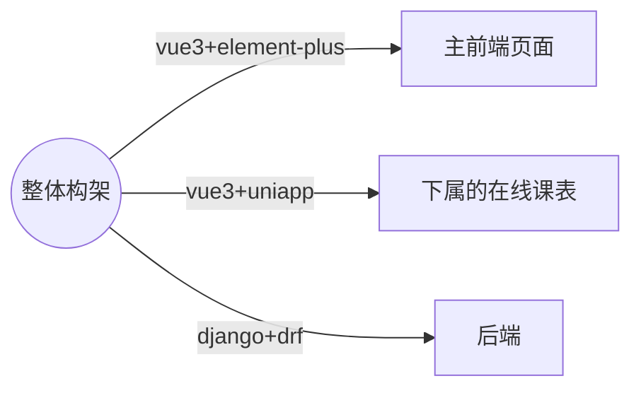
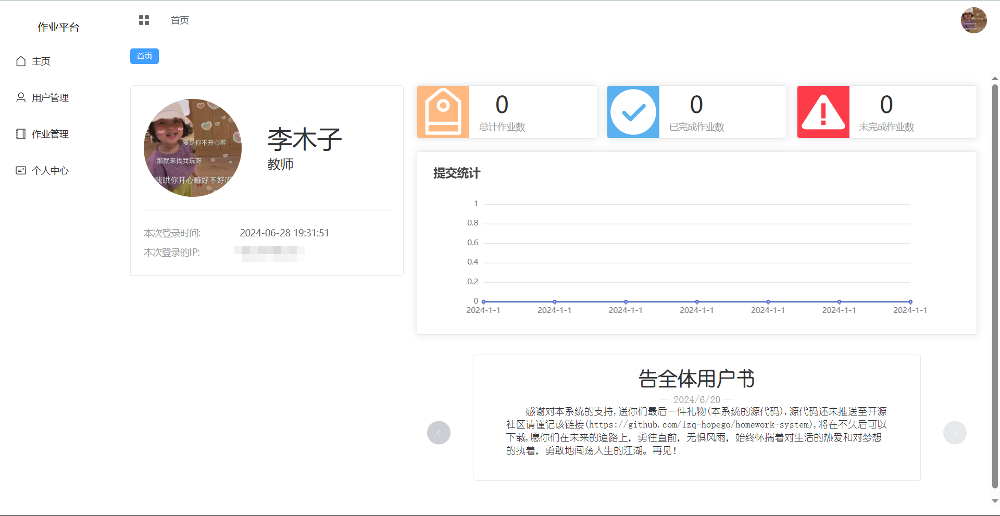
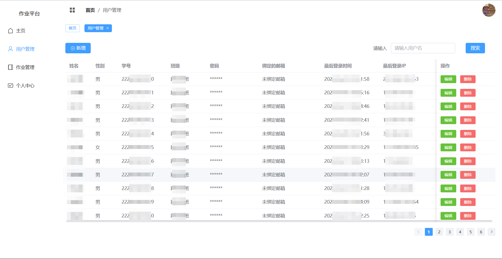
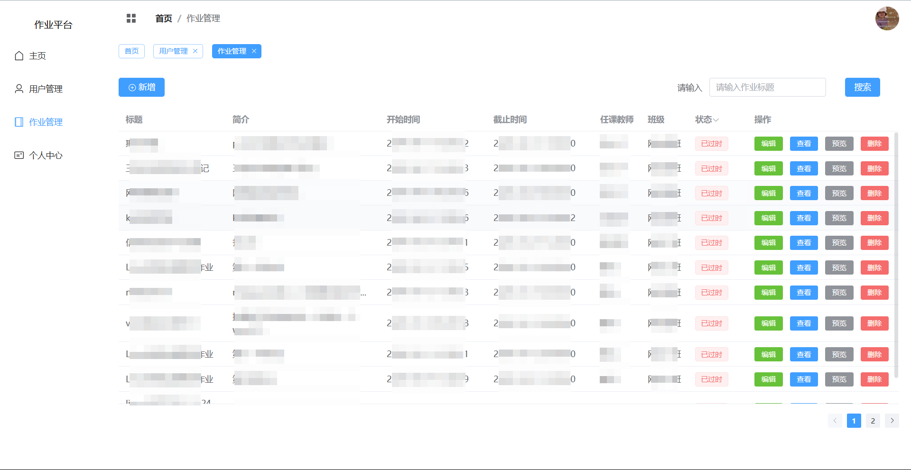
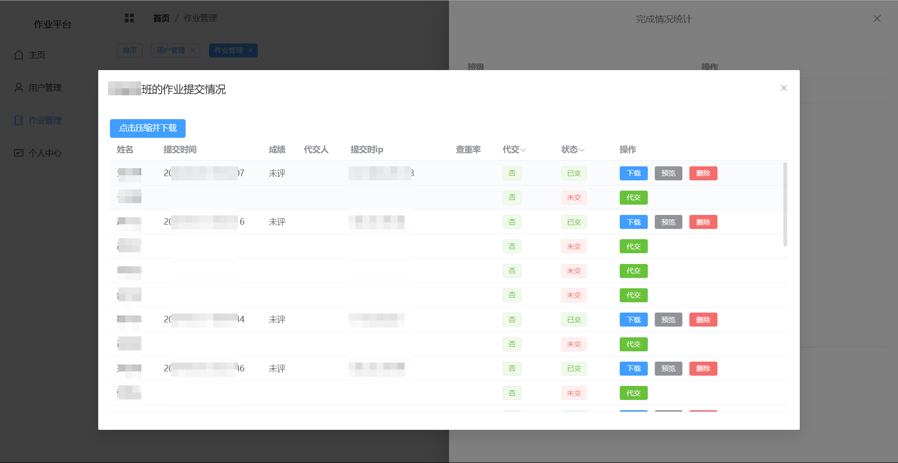
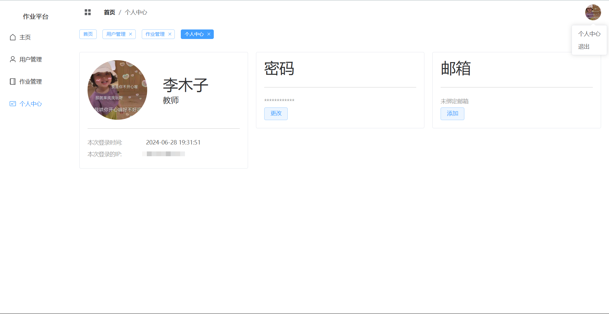

## 介绍
> 本项目是一个用于收集文件的系统，可以是各种文件。
- 使用到的技术有
  1. python+django+drf
  2. vue+element-plus+uniapp
  3. mysql或mariadb

## 架构

## 目录结构
- 前端构建生成的所有文件在服务器中的存储位置

  ```
  .
  ├── assets
  │   ├── glzylist-7rFqlkJ1.js
  │   ├── .........生成的所有的.js和.css文件
  ├── document
  │   └── index.html
  ├── index.html
  ├── kebiao
  │   ├── assets
  │   │   ├── index.24818f64.css
  │   │   ├── 生成的所有的.js和.css文件
  │   └── index.html
  ├── logo.png
  └── static
      ├── courses.ts
      └── logo.png
  ```

- django后端的目录结构

  ```
  .
  ├─apis
  │  └─migrations
  ├─ext
  ├─hms
  ├─homeworks
  ├─homework_prompt
  ├─tmp
  ├─User_Avatar
  └─zyzip
  ```

## 部署和测试

- python+django+drf后端

  [hms-readme](./hms/README.md)

- vue3+element-plus主前端

  [hms_vue3-readme](./hms_vue3/README.md)

- vue3+uniapp课表

  [ColorTimetable-readme](./ColorTimetable/README.md)

## 效果图

- 教师/管理端

  - 主页面
  
    
  - 用户管理页面
    
  - 作业管理页面
    
    
  - 个人中心
    > 可修改头像，密码和邮箱（用于找回密码）
    
